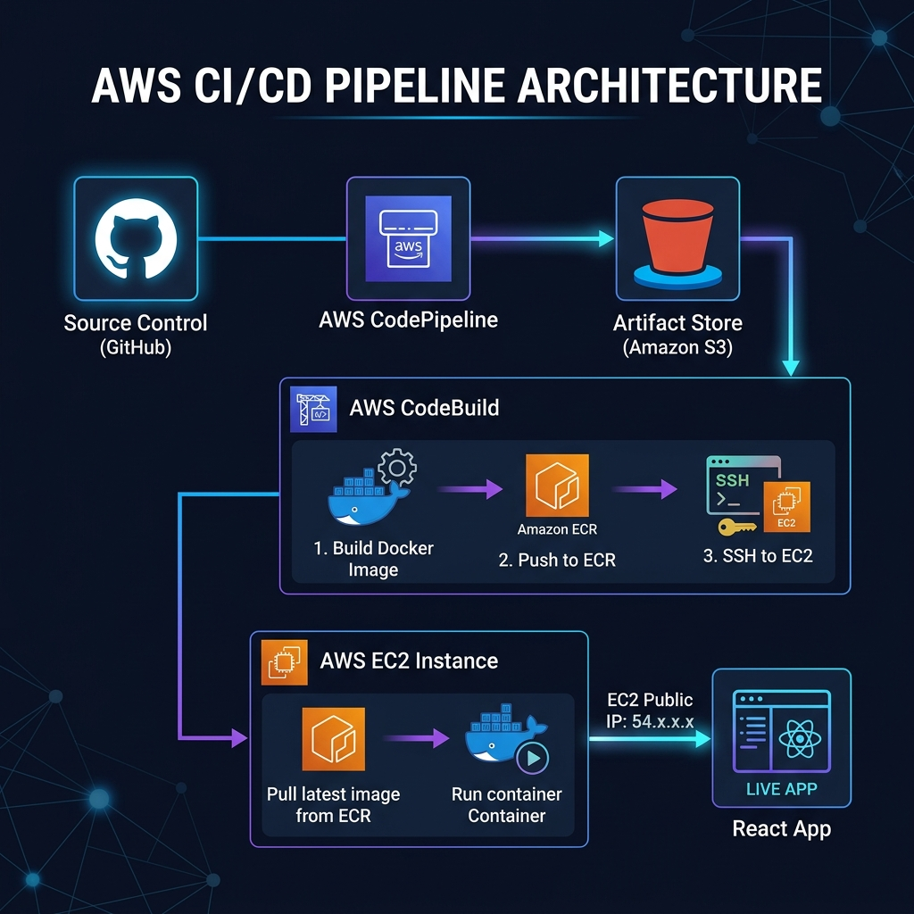

## aws-docker-cicd-react-app

A containerized React application deployed using a full CI/CD pipeline on AWS. The project demonstrates automated Docker image builds, image storage in Amazon ECR, and continuous deployment to an EC2 instance using AWS CodePipeline and CodeBuild.

Every code push triggers a pipeline that builds the React app, packages it into a Docker image, pushes it to a container registry, and updates the running application on EC2—showcasing a complete end-to-end DevOps workflow.

> [!NOTE]
> **Focus & Authorship**: This project is primarily designed to explore **CI/CD on AWS services** rather than the React frontend itself. The application code was created using **Google Antigravity** to provide a functional foundation for the automation pipeline.

### Tech Stack

* React (frontend)
* Docker (containerization)
* Amazon ECR (image registry)
* Amazon EC2 (deployment target)
* AWS CodePipeline & CodeBuild (CI/CD)

### Key Features

* Automated build and deployment pipeline
* Docker-based application delivery
* Continuous deployment to cloud infrastructure
* Low-cost, production-style setup

### Purpose

This project is designed to demonstrate practical DevOps concepts, including CI/CD automation, container workflows, and AWS service integration in a real-world deployment scenario.
---

### Project Status & Learning Journey

> [!IMPORTANT]
> **Resource Cleanup**: All AWS resources used for this demonstration (EC2 instances, ECR repositories, and CodePipeline/CodeBuild configurations) have been deleted to avoid ongoing costs. 
> 
> **Documentation**: You can view the full demonstration, including deployment results and screenshots, at the project's documentation page: [**Project Showcase**](https://jeffjojerjonescatulay.github.io/project-docu-pages/aws-docker-cicd-react-app/index.html)

**A Note on Improvements**: I am well aware that there are many areas for optimization and refinement in this pipeline (such as better IAM scoping, VPC networking, and secret management). This project is a documented milestone in my ongoing AWS learning journey, focused on understanding the core mechanics of CI/CD automation and container orchestration from the ground up.
