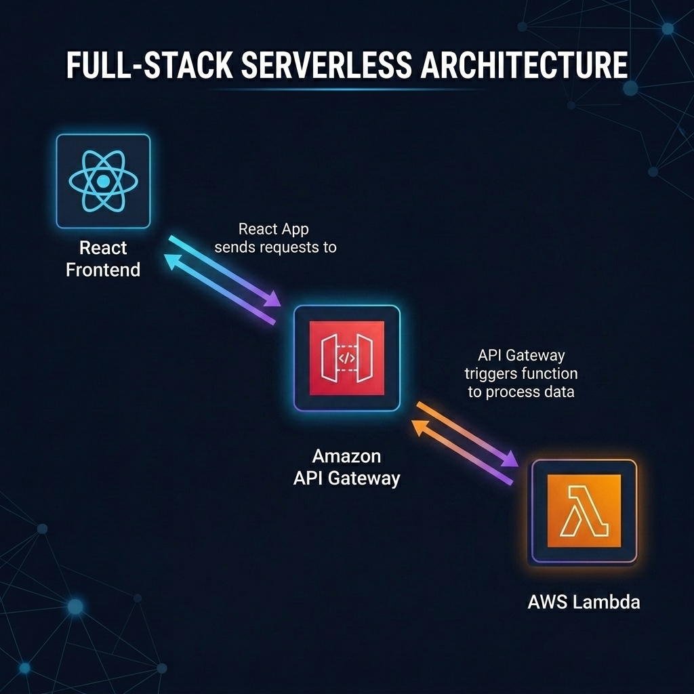
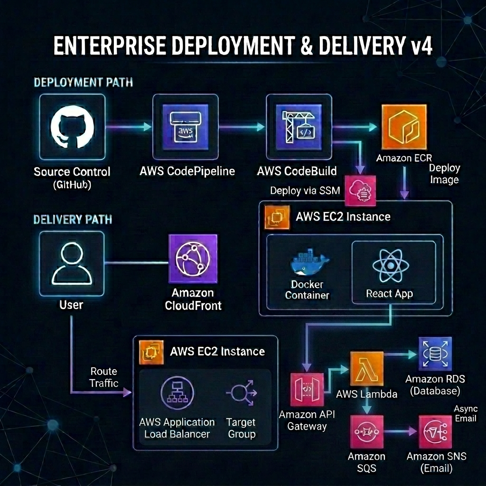
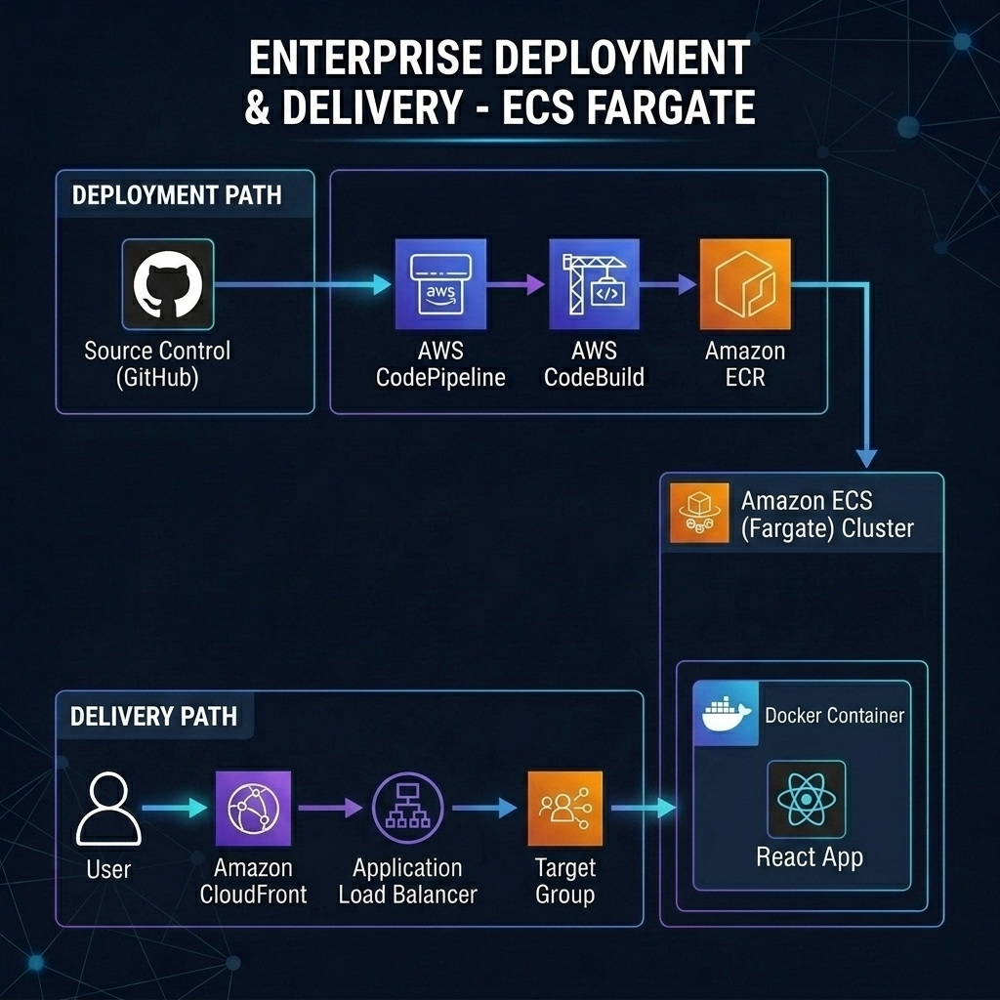
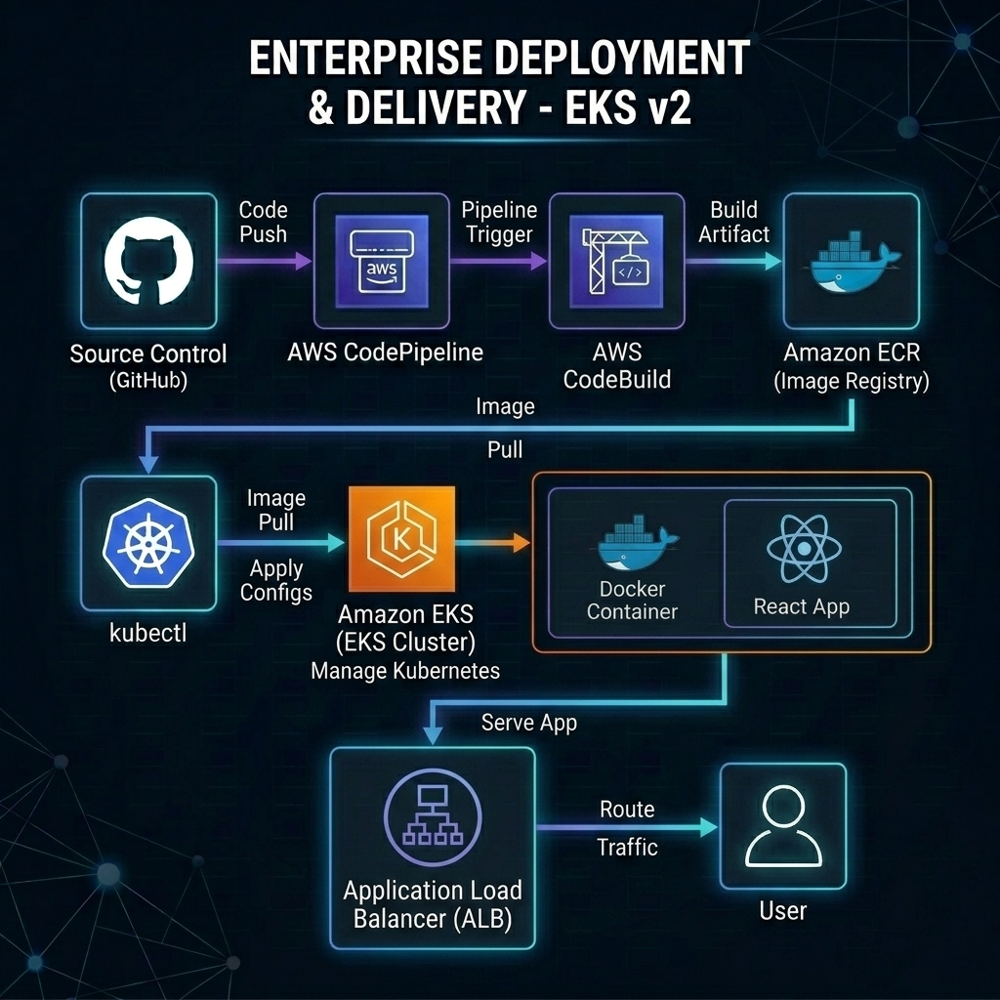

## aws-docker-cicd-react-app

A containerized React application deployed using a full CI/CD pipeline on AWS. The project demonstrates automated Docker image builds, image storage in Amazon ECR, and continuous deployment to an EC2 instance using AWS CodePipeline and CodeBuild.

Every code push triggers a pipeline that builds the React app, packages it into a Docker image, pushes it to a container registry, and updates the running application on EC2—showcasing a complete end-to-end DevOps workflow.

### Additional Project: aws-fullstack-cicd-react-lambda
Full-stack AWS project using React (Docker on EC2) integrated with a serverless backend (API Gateway + Lambda), deployed via a CI/CD pipeline using CodePipeline, CodeBuild, and ECR.

#### Serverless Backend Integration
In addition to the containerized frontend, this project integrates a serverless backend for dynamic data processing.

#### Advanced Delivery Infrastructure (v4)
This version adds a robust **Backend Services** layer. The React application communicates with **Amazon API Gateway**, which triggers **AWS Lambda** functions for processing. Lambda manages data persistence in **Amazon RDS** and initiates an asynchronous event-driven flow via **Amazon SQS** and **Amazon SNS** for email notifications. Deployments are now securely managed using **AWS Systems Manager (SSM)**.

### Additional Project: aws-ecs-fargate-cicd-app
A containerized web application deployed using Amazon ECS with AWS Fargate, integrated with a full CI/CD pipeline using AWS CodePipeline and AWS CodeBuild. The application is built as a Docker image, stored in Amazon ECR, and served through an Elastic Load Balancing, demonstrating automated deployments and scalable container orchestration on AWS.

### Additional Project: aws-eks-kubernetes-cicd-app
A complete DevOps pipeline that builds a Dockerized application, pushes it to Amazon ECR, and automatically deploys it to a Kubernetes cluster on Amazon EKS using AWS CodePipeline and AWS CodeBuild. This project demonstrates real-world CI/CD with Kubernetes on AWS.

> [!NOTE]
> **Author's Note on Kubernetes**: I am still relatively new to Kubernetes. This specific project serves as a practical, hands-on milestone in my ongoing learning journey to better understand cluster management and container orchestration on AWS.

> [!NOTE]
> **Focus & Authorship**: This project is primarily designed to explore **CI/CD on AWS services** rather than the React frontend itself. The application code was created using **Google Antigravity** to provide a functional foundation for the automation pipeline.

### Tech Stack

* React (frontend)
* Docker (containerization)
* Amazon ECR (image registry)
* Amazon EC2 & AWS Fargate (deployment targets)
* Amazon ECS & Amazon EKS (Container Orchestration & Kubernetes)
* AWS CodePipeline & CodeBuild (CI/CD)
* Amazon API Gateway (REST API)
* AWS Lambda (Serverless Compute)
* Amazon RDS (Database)
* Amazon SQS & SNS (Event-driven Messaging)
* AWS Systems Manager (SSM) Deployment
* Amazon CloudWatch (Build logging & Monitoring)
* Amazon CloudFront (CDN)
* Application Load Balancer (ALB) & Target Groups

### Key Features

* Automated build and deployment pipeline
* Docker-based application delivery
* Continuous deployment to cloud infrastructure
* Serverless Container Orchestration (ECS Fargate)
* Kubernetes Cluster Management (Amazon EKS)
* Low-cost, production-style setup
* Serverless backend integration (API Gateway + Lambda)
* Real-time build logs via Amazon CloudWatch
* Global content delivery via CloudFront
* Load balancing and high availability (ALB)
* Event-driven notifications (SQS/SNS)
* Secure agent-based deployments (SSM)

### Purpose

This project is designed to demonstrate practical DevOps concepts, including CI/CD automation, container workflows, and AWS service integration in a real-world deployment scenario.
---

### Project Status & Learning Journey

> [!IMPORTANT]
> **Resource Cleanup**: All AWS resources used for this demonstration (EC2 instances, ECR repositories, and CodePipeline/CodeBuild configurations) have been deleted to avoid ongoing costs. 
> 
> **Documentation**: You can view the full demonstration, including deployment results and screenshots, at the project's documentation page: [**Project Showcase**](https://jeffjojerjonescatulay.github.io/project-docu-pages/aws-docker-cicd-react-app/index.html)

**A Note on Improvements**: I am well aware that there are many areas for optimization and refinement in this pipeline (such as better IAM scoping, VPC networking, and secret management). This project is a documented milestone in my ongoing AWS learning journey, focused on understanding the core mechanics of CI/CD automation and container orchestration from the ground up.
